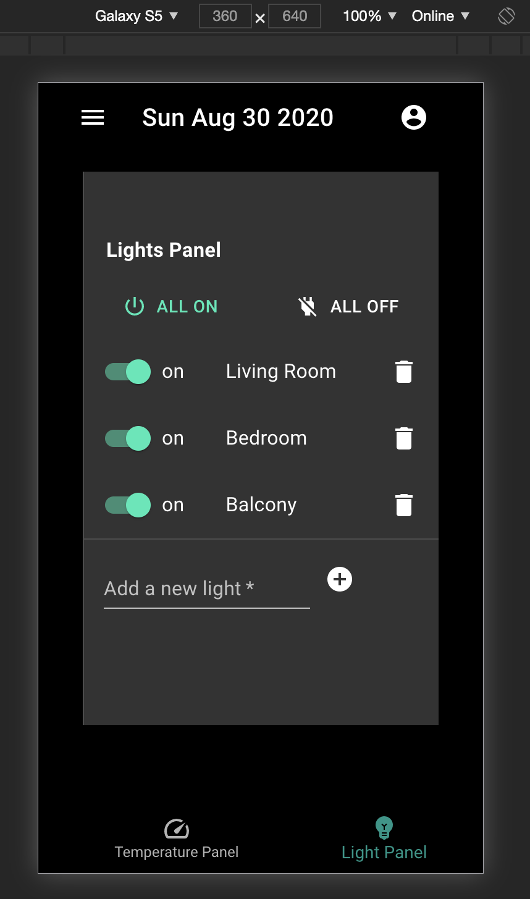
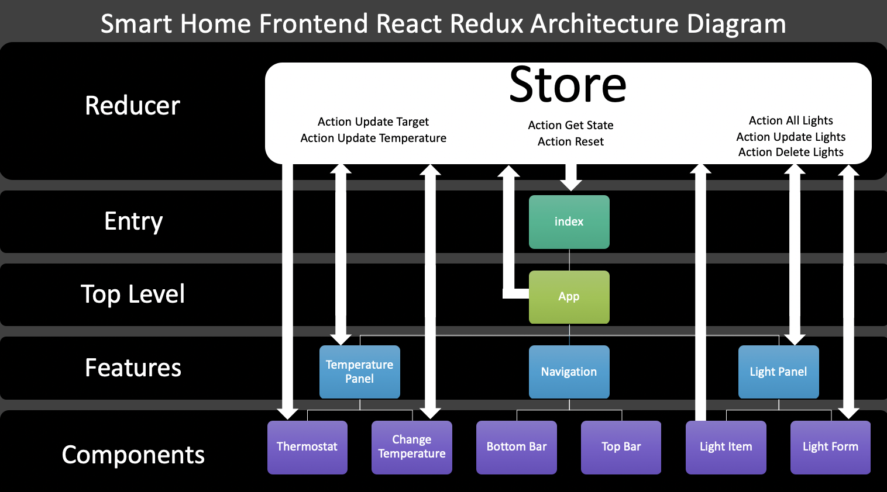

<h1 align="center">Smart Home</h1>
<h6 align="center">Author: Gabriela Aquino</h6>

<p align="center">
  
</p>

## Description
Application for home automation that turns lights on and off and controls temperature. This application was designed in a mobile first and adapted to multiple screens on the market.

<p align="center">
  
  
  
  
</p>


## Features
### Temperature Panel
- Thermostat
Tracks the temperature on change (if this application would be connect to a real temperature source it would track from the current until the temperature desired)
**Technical Challenges:** This feature utilizes SVG vectors for a interactive graphic visualization. Once the app is written in React this markup language needs to be used in caution for don't conflict with React on the DOM manipulation. 
- Change temperature slider
Thinking mobile first, this functionality is focused on the possibility to change the temperature on a touch screen without need of open keyboards and type numbers.
**Technical Challenges:** Thinking about small screens was really important decide a reasonable scale my end choice was each 10 degrees, because it was the max that fit in the smallest screen (but, I maybe would submit this to a AB testing and see if we can just replesent the first and last number ). 
- Eco mode switch 
Because sustainability is key, this feature gives the user the option of saving energy (if this application would reduce the pressure in the condenser, helping the motor to use less energy to run the system).
**Technical Challenges:** Leverage Redux, to create a centralized store ( also avoiding prop drills and unnecessary rerenders ) to connect the  eco switch to the thermostat engaging the end user with data representation.

### Light Panel
- Single light switch and delete light button
Gives the user the control of individual lights.
**Technical Challenges:** Create a reusable component that could auto generate for with consistency but also provide a unique key for identification. 
- All lights switch
Gives the user the control of all registered lights.
**Technical Challenges:** Again utilizing the centralized store could change the props of all instances.
- Add a new light form
Generate a new instance of the light component and updates database.
**Technical Challenges:** Again thinking on the mobile user this form needs to be really space efficient. Another concern here was security because any atry point of information can be a data bridge the input had to be scrubbed before be sended to the server. 

### Navigation
- Foot Navigation Bar
This let the user navigate between features. 
**Technical Challenges:** Thinking of this feature in a way that could be easily converted for a mobile app in the future and also support more features. Because that was a simple switch statement I decided to not use React-Router in this case (it is a really space expensive package but it may see need depending on the scale of implementation for the Top Navigation Bar functionality). 
- Top Navigation Bar
Shows the date and open menu possibilities where we could in the future add authentication, company info and user resources. 
**Technical Challenges:** Optimize space previewing scalability.


## Stack
### React
The choice of React comes with the SPA nature of this type of application designed to render views and easily convert between web or mobile. The reusability of the components and modularity was also key. The react architecture decision was based on the idea of Micro Front Ends, where the features are thinked as independent applications avoiding implicit dependencies and guaranteeing easy scalability and parallel work between teams. Also, React facilitates the implementation of SSR, utilizing the Virtual DOM without needing to update the whole view each time.

### Redux
The use of this state management library was chosen to create a single source of data that could interact with the entire application with consistency and performance. Redux avoids prop drills which also can be performance expensive. By connecting multiple components it ensures that each connected component only extracts the specific pieces of data from the store state that are needed by that component. This means that the component will need to re-render less often, because most of the time those specific pieces of data haven't changed. In addition Redux implements many performance optimizations internally to guarantee that components only re-renders when it actually needs to. On top of that, by keeping a local storage of the data as a Cache on the store avoids unnecessary server calls and gives the user a smooth experience.

### Material-UI
Thinking of the end user the use of a UI Framework can bring a lot of advantages. In this case the Google Material Design was chosen with the focus of enforcing mobile first development, screen sensitive design and aria label accessibility. From a developer perspective it gives speed and consistency to the development process.### TypescriptIn a developer perspective TypeScript comes to make the code easier to read, understand and debug. Leveraging productive development tools for JavaScript IDEs and practices, like static checking.

### Node / Express
Node and express was chosen to keep “language consistency" between front and back end. It is a cross-platform runtime environment built on V8, high-performance open-source JavaScript engine, ensures excellent performance in an event-driven, non-blocking I/O paradigm.


## Diagrams



## Run your own version
### Clone this repository
```bash
git clone https://github.com/aquinojardim/smarthome.git
```

### Install dependencies
```bash
npm install
```

### Run in development 
```bash
npm run dev
```

### Build the app
```bash
npm run build
```

### Start an instance
```bash
npm run start
```